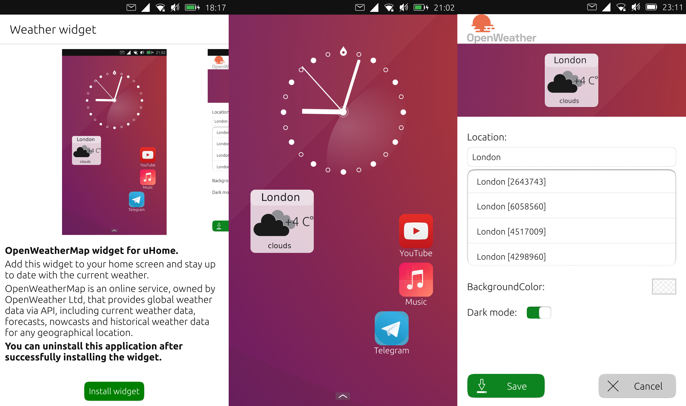

# Weather widget

OpenWeatherMap widget for uHome

Add this widget to your home screen and stay up to date with the current weather

OpenWeatherMap is an online service, owned by OpenWeather Ltd, that provides global weather data via API, including current weather data, forecasts, nowcasts and historical weather data for any geographical location.

**You can uninstall this application after successfully installing the widget.**

## Build
In the terminal, go to our directory with the project and enter the command:
    
    clickable
    
The project will compile and run on our phone

## License

Copyright (C) 2021  Pavel Prosto

This program is free software: you can redistribute it and/or modify it under the terms of the GNU General Public License version 3, as published
by the Free Software Foundation.

This program is distributed in the hope that it will be useful, but WITHOUT ANY WARRANTY; without even the implied warranties of MERCHANTABILITY, SATISFACTORY QUALITY, or FITNESS FOR A PARTICULAR PURPOSE.  See the GNU General Public License for more details.

You should have received a copy of the GNU General Public License along with this program.  If not, see <http://www.gnu.org/licenses/>.
